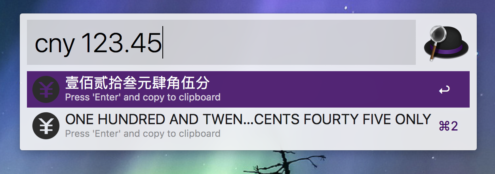
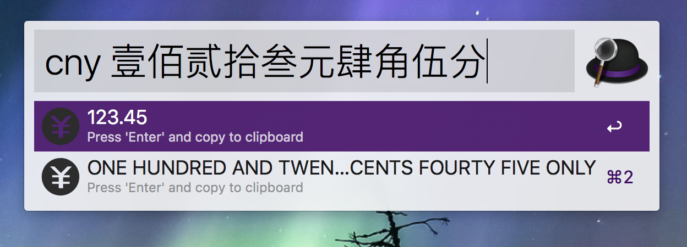
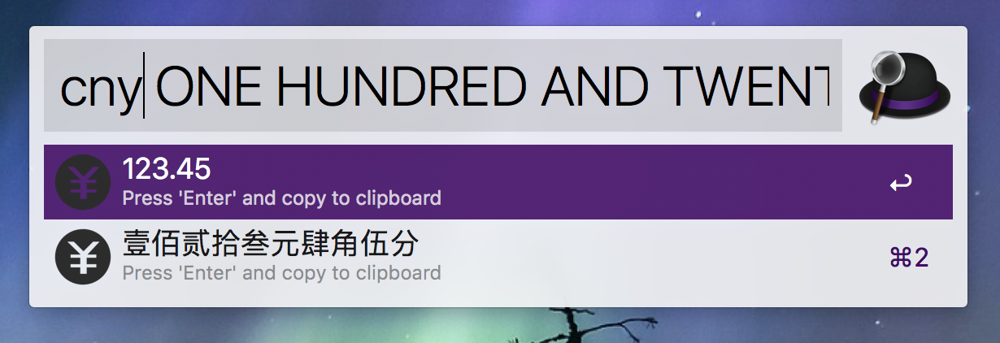

# AlfredWorkflow_CnyTransform
货币数字、中文大写和英文相互转换

## 一、使用说明

#### 1.最大数字支持9,999,999,999,999,999.99
#### 2.回车复制所选项到粘贴板
#### 3.cmd+回车直接打出所选项

## 二、下载地址
[从Github下载](https://github.com/Rouwanzi/AlfredWorkflow_CnyTransform/raw/master/CnyTransform_v1.0.alfredworkflow)

## 三、 Todo
- [ ] 换个好看的图标。。。

